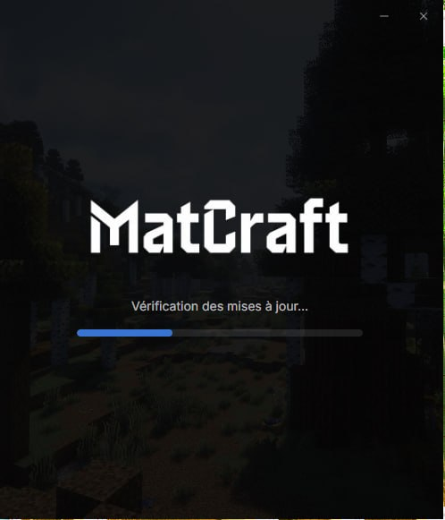
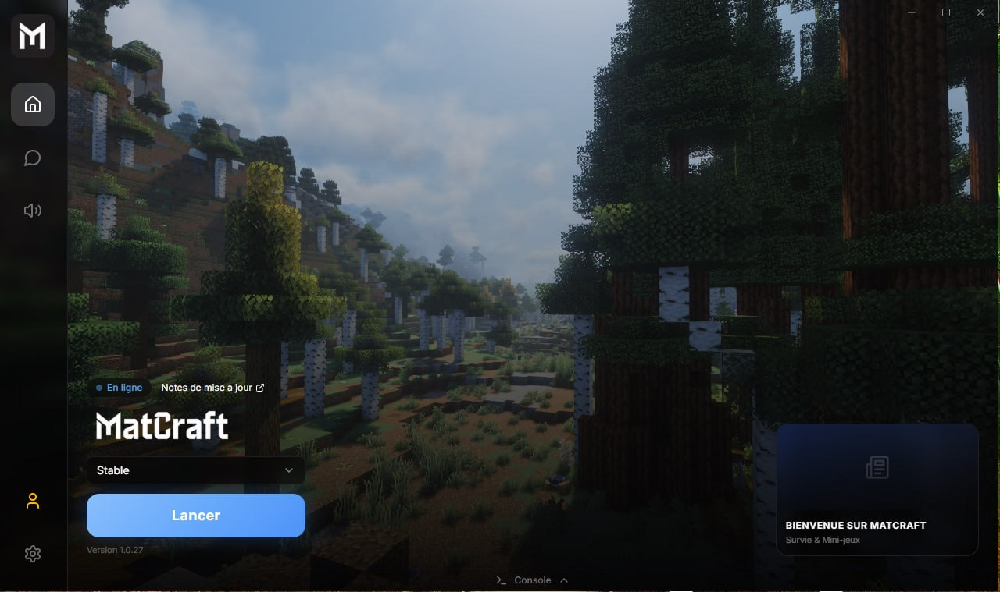
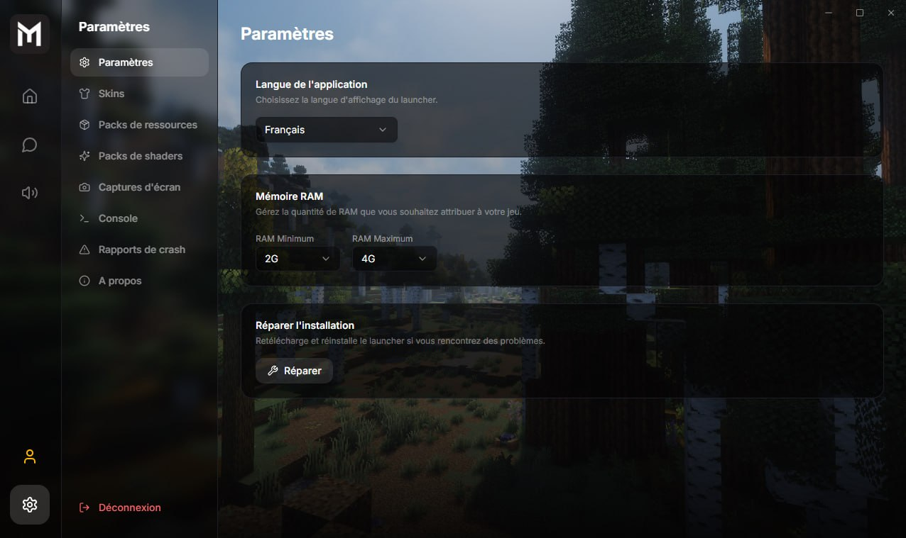

<div align="center">

# MatCraft Launcher

**Production-grade Electron launcher framework for game servers — auth, auto-update, mod management, and anti-tamper protection.**

[](https://www.electronjs.org/)
[](https://react.dev/)
[](https://www.typescriptlang.org/)
[](https://vite.dev/)
[]()

*Deployed for the MatCraft community — [matfaction.com](https://matfaction.com)*

</div>

---

## Screenshots

| Auto-Updater | Login | Launcher | Settings |
|:---:|:---:|:---:|:---:|
|  |  |  |  |

---

## Overview

MatCraft Launcher is a fully custom desktop application built from scratch as a production-ready replacement for the default Minecraft launcher. It handles the complete player lifecycle — from authentication to mod synchronization and game launch — with a polished UI and enterprise-grade security features.

The architecture is designed to be **game-agnostic**: the same launcher framework can be adapted to any game server with its own authentication API, auto-update endpoint, and asset pipeline.

**[FR]** Launcher desktop Electron de niveau production pour serveur de jeu — authentification, mises à jour automatiques, gestion des mods et protection anti-tamper. Architecture réutilisable pour tout serveur de jeu.

---

## Architecture

```
┌─────────────────────────────────────────────────────────┐
│                    Electron Main Process                 │
│  ┌──────────────┐  ┌──────────────┐  ┌───────────────┐  │
│  │  AZauth IPC  │  │  MC Launch   │  │ Auto-Updater  │  │
│  │  (azauth:*)  │  │ (minecraft:*)│  │  (updater:*)  │  │
│  └──────┬───────┘  └──────┬───────┘  └───────┬───────┘  │
│         └─────────────────┼──────────────────┘          │
│                    Context Bridge                        │
│                  (window.launcher API)                   │
└──────────────────────────┬──────────────────────────────┘
                           │
┌──────────────────────────▼──────────────────────────────┐
│                    React 19 Renderer                     │
│  ┌────────────┐  ┌───────────┐  ┌──────────────────┐    │
│  │ LoginView  │  │ MainView  │  │  SettingsView    │    │
│  └────────────┘  └───────────┘  └──────────────────┘    │
└─────────────────────────────────────────────────────────┘
```

---

## Key Features

**Authentication & Security**
- Player login via [Azuriom](https://azuriom.com/) (AZauth API) — compatible with any Azuriom-based game server
- Secure IPC via Electron context bridge — renderer never has direct Node.js access
- Production build: JS obfuscation (javascript-obfuscator) + C# obfuscation (ConfuserEx)
- DLL integrity guard — computed hashes prevent tampered native libraries from loading
- Anti-cheat pipeline: process snapshot, blacklist guard, DLL monitoring

**Auto-Update System**
- Full auto-update pipeline via `electron-updater` (generic provider)
- Updates served from `matfaction.com/launcher` — portable to any CDN or S3 bucket
- Graceful update flow: check → download → notify → install on quit
- Custom update screen with download progress and version display

**Game Launch Pipeline**
- One-click Minecraft launch (Fabric 1.21.11 + Java 21)
- Automatic mod synchronization — server-defined mod list deployed on every launch
- Launch progress streamed to UI in real-time (download speed, ETA, extraction status)
- RAM allocation selector + per-launch console output panel

**Developer Experience**
- `npm run dev` — hot-reload Vite renderer + Electron in watch mode
- `npm run dist` — full release build: renderer → obfuscate → `electron-builder --win`
- Automated deploy script: builds `.exe` + `latest.yml`, pushes to server via SFTP
- Vitest test suite covering auth flow and IPC contracts

---

## Tech Stack

| Layer | Technology |
|-------|-----------|
| **Desktop shell** | Electron 33 |
| **Renderer** | React 19, TypeScript, Vite 6, Tailwind v4, shadcn/ui |
| **Auth** | AZauth (Azuriom API) |
| **Game engine** | minecraft-java-core (Fabric 1.21.11 + Java 21) |
| **Auto-update** | electron-updater (generic provider) |
| **IPC** | Namespaced channels: `azauth:*`, `minecraft:*`, `updater:*`, `window:*` |
| **Security** | JS obfuscation, ConfuserEx (C#), DLL integrity hashing |
| **Build** | electron-builder (NSIS installer, Windows) |
| **CI/CD** | GitHub Actions + SFTP deploy |
| **Testing** | Vitest |

---

## Project Structure

```
matcraft-launcher/
├── main.js              # Electron main — IPC handlers, window management
├── preload.js           # Context bridge → window.launcher API surface
├── renderer/            # React 19 + Vite app (login, launcher, settings)
├── mods/                # Bundled Fabric mod JARs (auto-synced on launch)
├── lib/                 # DLL guard, integrity hashing, sync workers
├── panel/               # Admin panel backend (TypeScript + Hono)
├── scripts/             # Build obfuscation, release automation
└── sftp/                # Secure deployment scripts
```

---

## Quick Start

```bash
npm install          # also installs renderer/ deps (postinstall hook)
npm run dev          # Vite dev server + Electron hot reload
npm run dist         # Production build (Windows .exe)
```

---

## Adapting to Other Games

This launcher is built as a framework, not a Minecraft-specific tool. To target a different game:

1. Replace `minecraft-java-core` launch logic in `main.js`
2. Swap the auth provider (`AZauth` → any REST auth API)
3. Update the mod/asset sync endpoint in `lib/syncMods.js`
4. Point `electron-updater` to your own update server

The IPC contract (`window.launcher` API), the React UI, the auto-update pipeline, and the security layer are all game-agnostic.

---

## Author

**Mathieu Fournier** — [@Maaattqc](https://github.com/Maaattqc)

---

# Version française

MatCraft Launcher est un launcher desktop Electron de niveau production, construit de zéro pour remplacer le launcher Minecraft par défaut. Il gère l'authentification des joueurs, la synchronisation des mods, le lancement du jeu, et les mises à jour automatiques — avec une interface React moderne et une couche de sécurité complète.

**L'architecture est pensée pour être réutilisable** : le même framework peut être adapté à n'importe quel serveur de jeu avec son propre système d'authentification, son endpoint de mise à jour, et son pipeline d'assets.

**Stack:** Electron 33, React 19, TypeScript, Vite 6, Tailwind v4, electron-updater, minecraft-java-core, AZauth, Vitest.
