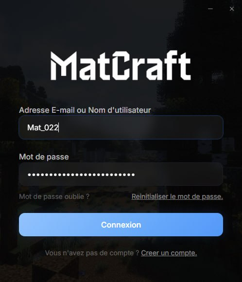

# MatCraft Launcher 🎮

> Custom Electron desktop launcher for the MatCraft Minecraft server — authentication, auto-updates, and mod management.
>
> Launcher desktop Electron sur mesure pour le serveur Minecraft MatCraft — authentification, mises à jour automatiques et gestion des mods.

## Preview



## 🚀 Overview / Aperçu

**[EN]** A polished desktop application that handles player authentication via Azuriom, launches Minecraft 1.21.11 with Fabric and bundled mods, manages auto-updates, and provides a modern React-based UI. Built as a complete replacement for the default Minecraft launcher, tailored for the MatCraft community at matfaction.com.

**[FR]** Une application desktop qui gère l'authentification des joueurs via Azuriom, lance Minecraft 1.21.11 avec Fabric et les mods inclus, gère les mises à jour automatiques, et offre une interface React moderne. Construit comme remplacement complet du launcher Minecraft par défaut, adapté pour la communauté MatCraft sur matfaction.com.

## 🛠️ Tech Stack

| Layer | Technology |
|-------|-----------|
| **Desktop** | Electron (main + preload + renderer) |
| **Frontend** | React 19, TypeScript, Vite, Tailwind v4, shadcn/ui |
| **Auth** | AZauth (Azuriom authentication API) |
| **Game Engine** | minecraft-java-core (Fabric 1.21.11 + Java 21) |
| **Auto-Update** | electron-updater (generic provider) |
| **IPC** | Electron ipcMain/ipcRenderer channels |
| **Security** | Code obfuscation (JS + C#), DLL guard, integrity hashing |
| **CI/CD** | GitHub Actions release pipeline |
| **Testing** | Vitest |

## 🧠 Technical Highlights / Défis Techniques

- **Secure IPC architecture** — context bridge pattern with `window.launcher` API, separating main process privileges from renderer
- **Multi-channel IPC** — `azauth:*`, `minecraft:*`, `launch:*`, `updater:*`, `window:*` namespaced channels for clean separation of concerns
- **Code protection** — JavaScript obfuscation, C# obfuscation via ConfuserEx, DLL guard with computed integrity hashes
- **Automated mod sync** — bundled `.jar` files automatically deployed to the game directory at launch
- **Auto-update pipeline** — electron-updater with generic provider serving from `matfaction.com/launcher`
- **Admin panel** — integrated server management panel (TypeScript backend)
- **SFTP deployment** — hardened SFTP setup scripts for secure file transfer

## ✨ Features / Fonctionnalités

- 🔐 **Player authentication** via Azuriom (matfaction.com)
- 🚀 **One-click launch** — Fabric 1.21.11 + Java 21 + bundled mods
- 🔄 **Auto-updates** — seamless version management
- 🎨 **Modern UI** — React 19 + Tailwind + shadcn/ui components
- 🛡️ **Anti-tamper** — code obfuscation + DLL integrity checks
- 📊 **Admin panel** — server management interface

## 📦 Installation

```bash
# Install dependencies (also installs renderer/)
npm install

# Development mode
npm run dev        # Vite dev server + Electron with --dev flag

# Production build (Windows)
npm run dist       # Builds renderer → obfuscates → electron-builder --win
```

## 📁 Architecture

```
matcraft-launcher/
├── main.js              # Electron main process
├── preload.js           # Context bridge (window.launcher API)
├── renderer/            # React 19 + Vite + Tailwind frontend
├── mods/                # Bundled Fabric mod JARs
├── panel/               # Admin panel (TypeScript)
├── hub/                 # Hub interface
├── lib/                 # DLL guard, integrity hashing, workers
├── scripts/             # Obfuscation & deployment scripts
└── sftp/                # SFTP setup & hardening
```

## 👤 Author / Auteur

**Mathieu Fournier** — [@Maaattqc](https://github.com/Maaattqc)
